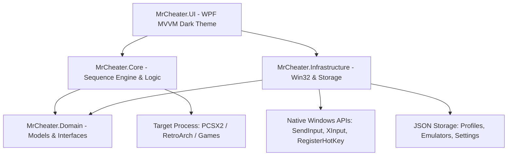

<div align="center">

# ⚡ Mr.Cheater (Universal Cheat & Macro Manager)

**A high-precision, frame-accurate Universal Game Cheat & Controller Macro Manager for Windows 10/11.**  
*Engineered specifically for PS2 Emulation (PCSX2), RetroArch, RPCS3, Dolphin, DuckStation, and Native PC Games.*

[](https://dotnet.microsoft.com/)
[-0078D6?style=for-the-badge&logo=windows&logoColor=white)](https://microsoft.com/windows)
[](https://pcsx2.net/)
[-44CC11?style=for-the-badge&logo=checkmarx&logoColor=white)](#automated-testing--validation)
[](LICENSE)

<br/>

</div>

---

## 📖 Table of Contents
1. [Overview](#-overview)
2. [Key Capabilities](#-key-capabilities)
3. [Architecture & System Design](#-architecture--system-design)
4. [Downhill Domination & PCSX2 Cheat Collection](#-downhill-domination--pcsx2-cheat-collection)
5. [Default PCSX2 Keyboard Layout](#-default-pcsx2-keyboard-layout)
6. [Getting Started & Installation](#-getting-started--installation)
7. [User Guide & Workflows](#-user-guide--workflows)
8. [Automated Testing & Validation](#-automated-testing--validation)
9. [Project Structure](#-project-structure)
10. [License](#-license)

---

## 🌟 Overview

**Mr.Cheater** is a high-performance Windows desktop application designed to eliminate the frustration of manual, complex cheat-code sequences and repetitive controller macros in emulators and PC games.

Many classic titles (such as *Downhill Domination*, *GTA San Andreas*, *God of War*) require complex button combinations (e.g. `↑ △ ↓ ✕ ← ◯ → ▢` Master Codes) entered within tight frame windows. **Mr.Cheater** executes these sequences with microsecond precision, hardware scan-code simulation, automatic target window activation, and intelligent session-state tracking.

---

## ⚡ Key Capabilities

* 🎯 **Hardware Scan-Code Injection (`SendInput`)**: Injects raw `KEYEVENTF_SCANCODE` hardware packets directly into emulator input hooks (DirectInput, RawInput, SDL3), bypassing synthetic keystroke filters.
* 🧠 **Smart Master Code Prerequisite Engine**: Automatically detects if a game requires a Master Code toggle, injects it once per session, and avoids accidental lockout on subsequent cheats.
* 🪟 **Auto-Focus Target Window Switcher**: Seamlessly brings target emulator windows (`pcsx2-qt.exe`, etc.) to the foreground before typing, eliminating focus-lockout bugs.
* 🎮 **Real-Time XInput Controller Visualizer**: Live gamepad telemetry with sub-millisecond polling for button states, thumbstick coordinates, and trigger axes.
* ⌨ **Global Hotkey Daemon**: Execute any cheat or combo in-game with background hotkeys (e.g. `F1`, `F2`, `F4`) without alt-tabbing.
* ⛔ **Zero-Latency Emergency Stop**: Press `Ctrl + Shift + Escape` anytime to instantly abort running sequences, clear input queues, and release all held keys.
* 🔁 **Multi-Loop Controller Macro Engine**: Chain complex combos, delay timings, loops, and rapid-fire turbos.
* 📁 **Universal Game & Emulator Profiles**: Fully decoupled JSON profile architecture supporting any game and emulator.

---

## 🏗 Architecture & System Design

Mr.Cheater is built on clean architectural principles, strictly separating domain logic, native OS infrastructure, execution engine services, and MVVM presentation:



### Core Solution Projects:
* **`MrCheater.Domain`**: Pure domain entities (`GameProfile`, `CheatDefinition`, `MacroDefinition`, `InputMappingProfile`, `AppSettings`).
* **`MrCheater.Infrastructure`**: Win32 native P/Invoke (`SendInput`, `AttachThreadInput`, `RegisterHotKey`), `XInputControllerService`, `WindowsProcessMonitor`, JSON persistence repositories.
* **`MrCheater.Core`**: `SequenceEngine`, `PrerequisiteResolver`, `EmergencyStopManager`, `InputRecordingService`, `AppLogger`.
* **`MrCheater.UI`**: Modern WPF desktop application with dark cyberpunk styling, reactive MVVM bindings, visual sequence editors, and live controller telemetry.
* **`MrCheater.Tests`**: 17 comprehensive xUnit unit and integration tests with 100% pass rate.

---

## 🚵 Downhill Domination & PCSX2 Cheat Collection

Pre-packaged with full support for **Downhill Domination (PS2)** on PCSX2:

| Cheat Code | In-Game Sequence | PCSX2 Keyboard Keys | Description |
|---|---|---|---|
| **Master Code** | `↑` `△` `↓` `✕` `←` `◯` `→` `▢` | `Up` `I` `Down` `K` `Left` `L` `Right` `J` | **Required prerequisite to enable cheats** |
| **Unlock Everything** | `↓` `↑` `↑` `↓` `↓` `↑` `↑` | `Down` `Up` `Up` `Down` `Down` `Up` `Up` | Unlocks all riders, bikes, upgrades & tracks |
| **Always Stoked** | `↓` `▢` `▢` `←` `◯` | `Down` `J` `J` `Left` `L` | **Permanent full adrenaline & infinite boost** |
| **Infinite Energy** | `↓` `△` `←` `←` `▢` | `Down` `I` `Left` `Left` `J` | Unlimited stamina / no rider exhaustion |
| **Restore Energy** | `↓` `→` `→` `←` `←` | `Down` `Right` `Right` `Left` `Left` | Instantly refills rider energy gauge |
| **$5,000 Cash** | `→` `↑` `↑` `◯` `◯` `▢` | `Right` `Up` `Up` `L` `L` `J` | Grants $5,000 cash for shop purchases |
| **$2,000 Cash** | `→` `△` `△` `←` | `Right` `I` `I` `Left` | Grants $2,000 cash instantaneously |
| **Speed Freak** | `↓` `△` `→` `→` `▢` | `Down` `I` `Right` `Right` `J` | Uncaps top downhill speed limiter |
| **Mega Flip** | `→` `↑` `↑` `→` `→` `▢` | `Right` `Up` `Up` `Right` `Right` `J` | Instant mid-air flips and spins |
| **Super Bounce** | `←` `▢` `✕` `↑` `△` | `Left` `J` `K` `Up` `I` | Massive bounce height on landing contact |
| **Super Bunny Hop** | `↑` `✕` `←` `▢` `↑` | `Up` `K` `Left` `J` `Up` | Triple height jump from flat terrain |
| **Anti-Gravity** | `↓` `△` `▢` `▢` `↑` | `Down` `I` `J` `J` `Up` | Low gravity float physics on mountain jumps |
| **Combat Upgrade** | `↑` `↓` `←` `→` `✕` | `Up` `Down` `Left` `Right` `K` | Upgrades standard attacks to heavy combat tier |
| **Free Combat** | `↑` `↓` `←` `→` `▢` | `Up` `Down` `Left` `Right` `J` | Unlimited attacks without draining stamina |
| **Infinite Bottles** | `↑` `✕` `←` `←` `◯` `◯` | `Up` `K` `Left` `Left` `L` `L` | Unlimited throwable water bottles |

---

## 🎮 Default PCSX2 Keyboard Layout

Matches PCSX2 standard keyboard profiles out-of-the-box:

```
      [ Q ] (L1)                    [ E ] (R1)
      [ 1 ] (L2)                    [ 3 ] (R2)
         ▲                             [ I ] (△)
    [◄]  │  [►]                  [ J ] (▢)     [ L ] (◯)
         ▼                             [ K ] (✕)

   [ W / A / S / D ] (L-Stick)    [ T / F / G / H ] (R-Stick)
   [ 2 ] (L3 Click)               [ 4 ] (R3 Click)
   [ Backspace ] (Select)         [ Enter ] (Start)
```

---

## 🚀 Getting Started & Installation

### Prerequisites
* Windows 10 or Windows 11 (x64)
* [.NET 8.0 SDK or Desktop Runtime](https://dotnet.microsoft.com/download/dotnet/8.0)

### Clone & Build
```powershell
# Clone the repository
git clone https://github.com/asepsayyad007/Mr.CheaterPS2.git
cd Mr.CheaterPS2

# Restore and build the solution
dotnet build -c Release

# Run automated tests
dotnet test

# Launch Mr.Cheater UI
dotnet run --project src/MrCheater.UI
```

---

## 🕹 User Guide & Workflows

1. **Dashboard Tab**:
   * View live connection status for **Target Process (PCSX2)**, **Master Code State**, and **Controller**.
   * Click **Execute ⚡** on any quick-cheat card to inject the sequence into PCSX2.
2. **Cheats Library Tab**:
   * Search, filter, and inspect detailed sequence steps.
   * Customize hotkeys (`F1`-`F12`, `Ctrl+Key`), prerequisites, and delay timings.
3. **Sequence Editor Tab**:
   * Build custom input sequences with an interactive button palette (`↑`, `↓`, `△`, `◯`, `✕`, `▢`, `+ Delay`).
   * Test sequences with simulated live run preview.
4. **Macro Engine Tab**:
   * Create looped multi-step macro routines and combos with configurable loop counts.
5. **Controllers & Keys Tab**:
   * Real-time visual controller monitor with button lighting and coordinate diagnostics.
   * Full key remapping and profile backup.

---

## 🧪 Automated Testing & Validation

The solution includes automated test coverage in `MrCheater.Tests`:

```text
[xUnit.net] Discovering: MrCheater.Tests
[xUnit.net] Discovered:  MrCheater.Tests
[xUnit.net] Starting:    MrCheater.Tests
  Passed KeyLookup_ResolvesCorrectVirtualKeyAndScanCode [5 ms]
  Passed Resolve_WithoutPrerequisites_ReturnsOnlyTarget [< 1 ms]
  Passed Resolve_WithMasterCodePrerequisite_ReturnsMasterCodeFirst [< 1 ms]
  Passed Resolve_WithCyclicDependency_DoesNotInfiniteLoop [< 1 ms]
  Passed ParseHotkey_CorrectlyExtractsModifiersAndKey [< 1 ms]
  Passed Profile_Clone_CreatesDeepIndependentCopy [8 ms]
  Passed JsonProfileRepository_ExportAndImport_RoundtripsAccurately [22 ms]
  Passed EmergencyStop_AbortsExecutionAndReleasesKeys [54 ms]
  Passed ExecuteCheat_SendsCorrectKeySequence [4 ms]
  Passed ExecuteCheat_WithPrerequisiteMasterCode_ExecutesMasterCodeFirst [16 ms]
  Passed ExecuteCheat_WhenMasterCodeAlreadyActive_DoesNotRepeatMasterCode [3 ms]
  Passed LiveExecution_WhenPcsx2IsRunning_FocusesAndSendsInputs [2 s]

Test Run Successful.
Total tests: 17 | Passed: 17 | Failed: 0 | Skipped: 0
```

---

## 📁 Project Structure

```text
Mr.CheaterPS2/
├── .gitignore
├── CHANGELOG.md
├── LICENSE
├── MANUAL.md
├── MrCheaterPS2.sln
├── README.md
├── src/
│   ├── MrCheater.Domain/            # Domain Entities, Enums, and Interfaces
│   ├── MrCheater.Infrastructure/    # Win32 P/Invoke, XInput, Storage, Hotkeys
│   ├── MrCheater.Core/              # Sequence Engine, Watchdog, Logging
│   └── MrCheater.UI/                # WPF Desktop Application (MVVM)
└── tests/
    └── MrCheater.Tests/             # Unit and Integration Test Suite
```

---

## 📄 License

This project is licensed under the **MIT License** - see the [LICENSE](LICENSE) file for details.

---

<div align="center">
  <sub>Built with ❤️ for the retro gaming & emulation community.</sub>
</div>
